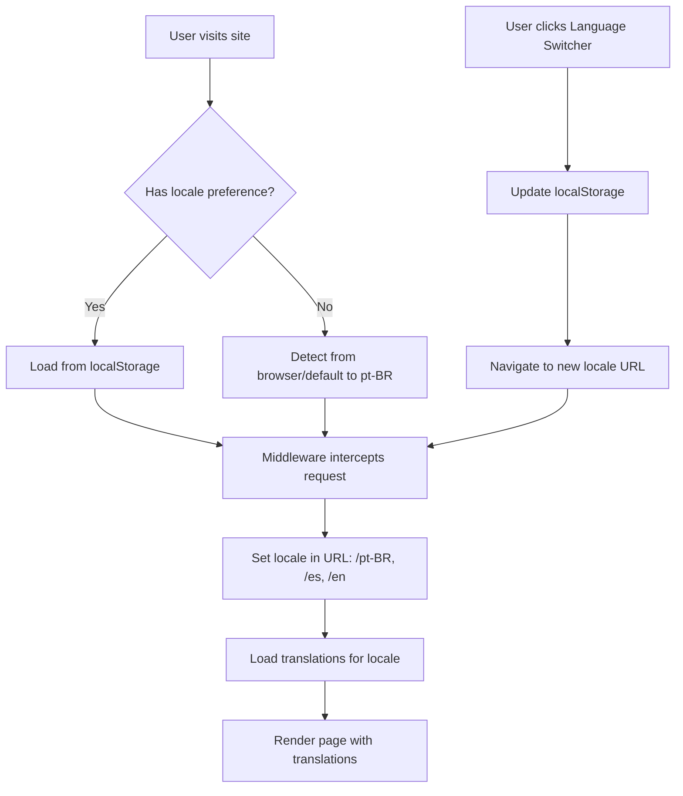

# Design Document

## Overview

Esta feature implementa internacionalização (i18n) no site Gold Mustache Barbearia usando `next-intl`, uma biblioteca moderna e otimizada para Next.js App Router. A solução é profissional, não over-engineered, e se integra perfeitamente com a arquitetura existente do projeto.

**Escolha da biblioteca:** `next-intl` foi selecionada por:
- Suporte nativo ao Next.js 15 App Router
- TypeScript type-safety para translation keys
- Server e Client Components support
- Bundle size otimizado (apenas traduções ativas são carregadas)
- Integração com metadata e SEO
- Comunidade ativa e bem mantida

## Architecture

### Directory Structure

```
src/
├── i18n/
│   ├── config.ts                 # Configuração central do i18n
│   ├── request.ts                # Configuração de locale por request
│   └── locales/
│       ├── pt-BR/
│       │   ├── common.json       # Traduções comuns (botões, labels)
│       │   ├── navigation.json   # Menu e navegação
│       │   ├── services.json     # Serviços da barbearia
│       │   ├── hero.json         # Hero section
│       │   ├── contact.json      # Seção de contato
│       │   └── metadata.json     # SEO e metadata
│       ├── es/
│       │   └── [same structure]
│       └── en/
│           └── [same structure]
├── components/
│   └── ui/
│       └── language-switcher.tsx # Componente seletor de idioma
├── middleware.ts                 # Middleware para locale detection
└── app/
    └── [locale]/                 # Dynamic route segment
        ├── layout.tsx            # Layout com locale provider
        └── page.tsx              # Home page
```

### Locale Management Flow



## Components and Interfaces

### 1. Language Switcher Component

**Location:** `src/components/ui/language-switcher.tsx`

**Design:** Dropdown button similar ao ThemeToggle, mantendo consistência visual

```typescript
interface LanguageSwitcherProps {
  variant?: 'desktop' | 'mobile';
}

// Locales suportados
type Locale = 'pt-BR' | 'es' | 'en';

interface LocaleOption {
  code: Locale;
  label: string;
  flag: string; // Emoji flag
}
```

**Visual Design:**
- Desktop: Botão compacto com flag + código (🇧🇷 PT)
- Mobile: Item no Sheet menu com flags e labels completos
- Dropdown: Lista com as 3 opções, highlight no idioma ativo
- Animação: Smooth transition usando framer-motion (já no projeto)

### 2. i18n Configuration

**Location:** `src/i18n/config.ts`

```typescript
export const locales = ['pt-BR', 'es', 'en'] as const;
export const defaultLocale = 'pt-BR' as const;

export type Locale = (typeof locales)[number];

export const localeNames: Record<Locale, { native: string; flag: string }> = {
  'pt-BR': { native: 'Português', flag: '🇧🇷' },
  'es': { native: 'Español', flag: '🇪🇸' },
  'en': { native: 'English', flag: '🇺🇸' }
};
```

### 3. Middleware

**Location:** `src/middleware.ts`

Responsável por:
- Detectar locale preferido (localStorage → browser → default)
- Redirecionar para URL com locale (/pt-BR/*, /es/*, /en/*)
- Manter locale em cookies para SSR

### 4. Translation Hook

```typescript
// Uso em Client Components
'use client';
import { useTranslations } from 'next-intl';

function MyComponent() {
  const t = useTranslations('navigation');
  return <span>{t('home')}</span>; // Type-safe!
}

// Uso em Server Components
import { getTranslations } from 'next-intl/server';

async function MyServerComponent() {
  const t = await getTranslations('navigation');
  return <span>{t('home')}</span>;
}
```

## Data Models

### Translation File Structure

**Example:** `src/i18n/locales/pt-BR/navigation.json`

```json
{
  "home": "Início",
  "services": "Serviços",
  "instagram": "Instagram",
  "events": "Eventos",
  "contact": "Contato",
  "sponsors": "Patrocinadores"
}
```

**Example:** `src/i18n/locales/pt-BR/common.json`

```json
{
  "buttons": {
    "book": "Agendar",
    "follow": "Seguir no Instagram",
    "bookAppointment": "Agendar Horário",
    "close": "Fechar"
  },
  "aria": {
    "openMenu": "Abrir menu",
    "closeMenu": "Fechar menu",
    "changeLanguage": "Alterar idioma"
  }
}
```

### Services Translation Strategy

Serviços serão traduzidos mantendo a estrutura do `SERVICES` array:

```json
{
  "services": {
    "corte-tradicional": {
      "name": "Corte Simples",
      "description": "Corte simples com tesoura e navalha"
    },
    "corte-degrade": {
      "name": "Corte Degradê Navalhado",
      "description": "Corte degradê navalhado com tesoura"
    }
    // ... outros serviços
  }
}
```

## Error Handling

### Missing Translation Keys

```typescript
// Fallback strategy
1. Tenta carregar key no locale atual
2. Se não existir, fallback para pt-BR
3. Se ainda não existir, mostra a key em desenvolvimento
4. Em produção, mostra string vazia e loga erro
```

### Locale Detection Failures

```typescript
// Se middleware falhar ao detectar locale
1. Default para pt-BR
2. Log error para monitoring
3. Continua execução normalmente
```

### Storage Failures

```typescript
// Se localStorage não estiver disponível
1. Usa apenas cookies para persistência
2. Fallback para session-only preference
```

## Testing Strategy

### Unit Tests (Optional)

- `language-switcher.test.tsx`: Testa renderização e interação do componente
- `i18n/config.test.ts`: Valida configurações e helpers

### Integration Tests (Optional)

- Testar navegação entre locales
- Verificar persistência de preferência
- Validar fallback para locale padrão

### Manual Testing Checklist

**Desktop:**
1. ✓ Language switcher visível no header
2. ✓ Dropdown abre ao clicar
3. ✓ Idioma atual está highlighted
4. ✓ Troca de idioma atualiza todo conteúdo
5. ✓ Preferência persiste após reload

**Mobile:**
1. ✓ Language switcher no menu mobile
2. ✓ Touch target adequado (44x44px)
3. ✓ Menu fecha após seleção
4. ✓ Animações smooth

**Geral:**
1. ✓ URLs refletem locale (/pt-BR, /es, /en)
2. ✓ HTML lang attribute atualiza
3. ✓ Metadata/SEO atualiza por locale
4. ✓ Sem flash de conteúdo não traduzido (FOUC)

## Integration Points

### 1. Header Component

Adicionar `<LanguageSwitcher />` ao lado do `<ThemeToggle />`:

```tsx
// Desktop
<div className="hidden md:flex items-center space-x-3">
  <LanguageSwitcher variant="desktop" />
  <ThemeToggle />
  {/* ... outros botões */}
</div>

// Mobile
<div className="md:hidden flex items-center space-x-2">
  <LanguageSwitcher variant="mobile" />
  <ThemeToggle />
  {/* ... menu */}
</div>
```

### 2. Layout Component

Wrap com `NextIntlClientProvider`:

```tsx
import { NextIntlClientProvider } from 'next-intl';
import { getMessages } from 'next-intl/server';

export default async function LocaleLayout({ 
  children, 
  params: { locale } 
}: { 
  children: React.ReactNode;
  params: { locale: string };
}) {
  const messages = await getMessages();
  
  return (
    <html lang={locale}>
      <body>
        <NextIntlClientProvider messages={messages}>
          {children}
        </NextIntlClientProvider>
      </body>
    </html>
  );
}
```

### 3. Metadata Generation

```tsx
// app/[locale]/layout.tsx
export async function generateMetadata({ params: { locale } }) {
  const t = await getTranslations({ locale, namespace: 'metadata' });
  
  return {
    title: t('title'),
    description: t('description'),
    // ... outros campos
  };
}
```

### 4. Constants Migration

Migrar `SERVICES` para usar traduções:

```tsx
// Antes
const service = SERVICES[0];
<h3>{service.name}</h3>

// Depois
const t = useTranslations('services');
const service = SERVICES[0];
<h3>{t(`${service.id}.name`)}</h3>
```

## Performance Considerations

### Bundle Size

- Apenas traduções do locale ativo são carregadas
- JSON files são tree-shakeable
- Estimativa: ~5KB por locale (gzipped)

### Runtime Performance

- Traduções são cached após primeira carga
- Middleware é edge-optimized
- Sem re-renders desnecessários (locale em URL)

### SEO Impact

- URLs separadas por locale (/pt-BR, /es, /en)
- hreflang tags automáticos
- Metadata localizada
- Sitemap com todas as versões de idioma

## Accessibility

- Language switcher com labels ARIA apropriados
- Keyboard navigation completa
- Screen reader friendly
- HTML lang attribute sempre correto
- Focus management no dropdown

## Migration Path

### Phase 1: Setup
1. Instalar next-intl
2. Criar estrutura de pastas
3. Configurar middleware
4. Criar translation files para pt-BR (baseline)

### Phase 2: Component
1. Criar LanguageSwitcher component
2. Integrar no Header (desktop + mobile)
3. Implementar persistência

### Phase 3: Content
1. Traduzir navigation
2. Traduzir common strings
3. Traduzir services
4. Traduzir hero, contact, metadata

### Phase 4: Testing & Polish
1. Testes manuais
2. Ajustes de UX
3. Performance check
4. Deploy
