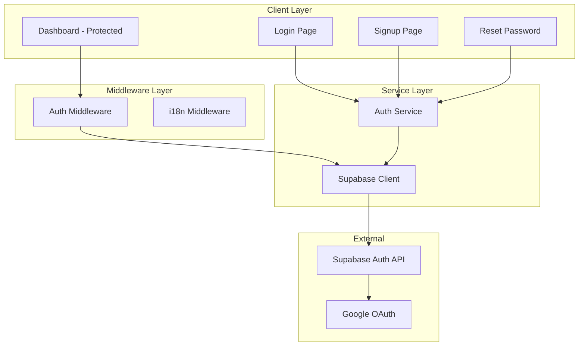

# Design Document - Supabase Auth

## Overview

Sistema de autenticação completo utilizando Supabase Auth integrado ao Next.js 15 App Router. A arquitetura segue o padrão SSR do Supabase com cookies para gerenciamento de sessão, middleware para proteção de rotas, e componentes client-side para interação do usuário.

## Architecture



## Components and Interfaces

### Supabase Clients

```typescript
// src/lib/supabase/client.ts - Browser client
import { createBrowserClient } from '@supabase/ssr'

export function createClient() {
  return createBrowserClient(
    process.env.NEXT_PUBLIC_SUPABASE_URL!,
    process.env.NEXT_PUBLIC_SUPABASE_ANON_KEY!
  )
}

// src/lib/supabase/server.ts - Server client
import { createServerClient } from '@supabase/ssr'
import { cookies } from 'next/headers'

export async function createClient() {
  const cookieStore = await cookies()
  return createServerClient(
    process.env.NEXT_PUBLIC_SUPABASE_URL!,
    process.env.NEXT_PUBLIC_SUPABASE_ANON_KEY!,
    {
      cookies: {
        getAll() { return cookieStore.getAll() },
        setAll(cookiesToSet) {
          cookiesToSet.forEach(({ name, value, options }) =>
            cookieStore.set(name, value, options)
          )
        },
      },
    }
  )
}

// src/lib/supabase/middleware.ts - Middleware client
import { createServerClient } from '@supabase/ssr'
import { NextResponse, type NextRequest } from 'next/server'

export async function updateSession(request: NextRequest) {
  // Refresh session and update cookies
}
```

### Auth Service

```typescript
// src/services/auth.ts
interface AuthService {
  signUp(email: string, password: string): Promise<AuthResponse>
  signIn(email: string, password: string): Promise<AuthResponse>
  signInWithGoogle(): Promise<void>
  signOut(): Promise<void>
  resetPassword(email: string): Promise<void>
  updatePassword(password: string): Promise<void>
  getUser(): Promise<User | null>
  getSession(): Promise<Session | null>
}
```

### Form Schemas (Zod)

```typescript
// src/lib/validations/auth.ts
import { z } from 'zod'

export const loginSchema = z.object({
  email: z.string().email('Email inválido'),
  password: z.string().min(6, 'Mínimo 6 caracteres'),
})

export const signupSchema = z.object({
  email: z.string().email('Email inválido'),
  password: z.string().min(6, 'Mínimo 6 caracteres'),
  confirmPassword: z.string(),
}).refine(data => data.password === data.confirmPassword, {
  message: 'Senhas não conferem',
  path: ['confirmPassword'],
})

export const resetSchema = z.object({
  email: z.string().email('Email inválido'),
})

export const newPasswordSchema = z.object({
  password: z.string().min(6, 'Mínimo 6 caracteres'),
  confirmPassword: z.string(),
}).refine(data => data.password === data.confirmPassword, {
  message: 'Senhas não conferem',
  path: ['confirmPassword'],
})
```

### React Query Hooks

```typescript
// src/hooks/useAuth.ts
import { useMutation, useQuery, useQueryClient } from '@tanstack/react-query'

export function useUser() {
  return useQuery({
    queryKey: ['user'],
    queryFn: () => authService.getUser(),
  })
}

export function useSignIn() {
  return useMutation({
    mutationFn: (data: LoginInput) => authService.signIn(data.email, data.password),
    onSuccess: () => queryClient.invalidateQueries({ queryKey: ['user'] }),
  })
}

export function useSignUp() {
  return useMutation({
    mutationFn: (data: SignupInput) => authService.signUp(data.email, data.password),
  })
}

export function useSignOut() {
  return useMutation({
    mutationFn: () => authService.signOut(),
    onSuccess: () => queryClient.clear(),
  })
}
```

### UI Components

```typescript
// src/components/auth/LoginForm.tsx
// src/components/auth/SignupForm.tsx
// src/components/auth/ResetPasswordForm.tsx
// src/components/auth/NewPasswordForm.tsx
// src/components/auth/GoogleButton.tsx
// src/components/auth/AuthCard.tsx (wrapper layout)
```

## Data Models

### User Type (from Supabase)

```typescript
interface User {
  id: string
  email: string
  email_confirmed_at: string | null
  created_at: string
  updated_at: string
  app_metadata: {
    provider: string
    providers: string[]
  }
  user_metadata: {
    full_name?: string
    avatar_url?: string
  }
}
```

### Session Type

```typescript
interface Session {
  access_token: string
  refresh_token: string
  expires_at: number
  expires_in: number
  user: User
}
```

### Prisma Schema

```prisma
// prisma/schema.prisma
generator client {
  provider = "prisma-client-js"
}

datasource db {
  provider  = "postgresql"
  url       = env("DATABASE_URL")
  directUrl = env("DIRECT_URL")
}

model Profile {
  id        String   @id @default(uuid())
  userId    String   @unique @map("user_id")
  fullName  String?  @map("full_name")
  avatarUrl String?  @map("avatar_url")
  phone     String?
  createdAt DateTime @default(now()) @map("created_at")
  updatedAt DateTime @updatedAt @map("updated_at")

  @@map("profiles")
}
```

### Prisma Client

```typescript
// src/lib/prisma.ts
import { PrismaClient } from '@prisma/client'

const globalForPrisma = globalThis as unknown as { prisma: PrismaClient }

export const prisma = globalForPrisma.prisma || new PrismaClient()

if (process.env.NODE_ENV !== 'production') globalForPrisma.prisma = prisma
```

### Auth Response

```typescript
interface AuthResponse {
  user: User | null
  session: Session | null
  error: AuthError | null
}

interface AuthError {
  message: string
  status: number
}
```

## Route Structure

```
src/app/[locale]/
├── (auth)/                    # Auth group (public)
│   ├── login/page.tsx
│   ├── signup/page.tsx
│   ├── reset-password/page.tsx
│   └── auth/callback/route.ts # OAuth callback
├── (protected)/               # Protected group
│   ├── layout.tsx             # Auth check wrapper
│   └── dashboard/page.tsx
```


## Correctness Properties

*A property is a characteristic or behavior that should hold true across all valid executions of a system-essentially, a formal statement about what the system should do. Properties serve as the bridge between human-readable specifications and machine-verifiable correctness guarantees.*

### Property 1: Schema validation rejects invalid inputs

*For any* string that is not a valid email format OR any password string with length less than 6 characters, the validation schema SHALL reject the input and return appropriate error messages.

**Validates: Requirements 1.3, 1.4**

### Property 2: Schema validation accepts valid inputs

*For any* valid email string AND password string with 6 or more characters, the validation schema SHALL accept the input without errors.

**Validates: Requirements 1.3, 1.4 (inverse)**

### Property 3: Password confirmation must match

*For any* signup form data where password and confirmPassword fields differ, the schema SHALL reject with a mismatch error.

**Validates: Requirements 1.3**

### Property 4: Middleware redirects unauthenticated requests

*For any* request to a protected route without a valid session, the middleware SHALL return a redirect response to the login page.

**Validates: Requirements 6.1**

### Property 5: Middleware allows authenticated requests

*For any* request to a protected route with a valid session, the middleware SHALL allow the request to proceed.

**Validates: Requirements 6.2**

### Property 6: Form submission blocked with invalid data

*For any* form state containing validation errors, the form SHALL prevent submission.

**Validates: Requirements 7.2, 7.4**

## Error Handling

### Client-Side Errors

| Error Type | Handling Strategy |
|------------|-------------------|
| Validation Error | Display inline error via React Hook Form |
| Network Error | Display toast with retry option |
| Auth Error | Display toast with specific message |
| Session Expired | Redirect to login with message |

### Server-Side Errors

| Error Type | Handling Strategy |
|------------|-------------------|
| Invalid Credentials | Return generic "Invalid credentials" message |
| Email Not Confirmed | Return specific message to check email |
| Rate Limited | Return 429 with retry-after header |
| Server Error | Return 500 with generic message |

### Toast Notifications (Sonner)

```typescript
// Success toasts
toast.success('Conta criada! Verifique seu email.')
toast.success('Login realizado com sucesso!')
toast.success('Logout realizado.')
toast.success('Email de recuperação enviado.')

// Error toasts
toast.error('Credenciais inválidas.')
toast.error('Email já cadastrado.')
toast.error('Sessão expirada. Faça login novamente.')
```

## Testing Strategy

### Unit Tests

- Zod schema validation for all form schemas
- Auth service method signatures and error handling
- Utility functions for session management

### Property-Based Tests (fast-check)

Property-based tests will use `fast-check` library (already in devDependencies) to verify:

1. **Schema validation properties** - Generate random strings and verify schema correctly accepts/rejects
2. **Password matching property** - Generate random password pairs and verify confirmation logic
3. **Middleware routing property** - Generate mock requests and verify correct routing decisions

Each property test will run minimum 100 iterations.

### Integration Tests

- OAuth callback flow
- Session refresh mechanism
- Protected route access with real Supabase client

### Test File Structure

```
src/lib/validations/__tests__/
├── auth.test.ts           # Unit tests for schemas
├── auth.property.test.ts  # Property-based tests

src/services/__tests__/
├── auth.test.ts           # Auth service tests

src/middleware.test.ts     # Middleware routing tests
```
